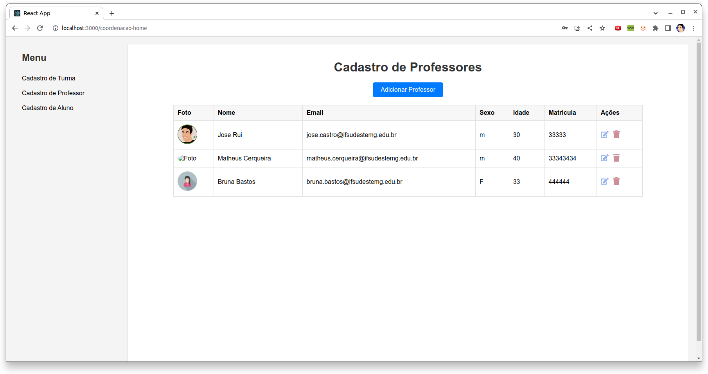

# Projeto Educação Fisicai - IFET


 

## Fluxo do Sistema

### Fluxo de Cadastro e Autenticação

#### Cadastro pelo Coordenador:
- O coordenador acessa uma área restrita, que pode ser protegida através de autenticação ou uma chave secreta.
- Ele tem duas opções principais: "Cadastrar Professor" e "Cadastrar Aluno".

#### Cadastro de Professor/Aluno:
- O coordenador preenche os detalhes necessários, como nome, email, entre outros.
- Ao enviar o formulário, o sistema realiza as seguintes ações:
  1. Cria uma conta no Firebase Authentication usando o email fornecido e uma senha padrão (e.g., "123456").
  2. Salva os detalhes adicionais no Firestore, utilizando o UID gerado como chave do documento.

#### Primeiro Acesso do Professor/Aluno:
- No primeiro acesso, o professor ou aluno utiliza a senha padrão fornecida.
- Se o sistema detectar que é a senha padrão sendo utilizada, ele solicitará que o usuário altere essa senha imediatamente.

#### Mudança de Senha:
- O usuário é direcionado a uma tela onde poderá definir sua nova senha pessoal.
- Após a atualização da senha, o sistema não solicitará mais essa alteração em futuros acessos.

#### Fluxo Normal de Login:
- Após o primeiro acesso e alteração da senha, os usuários poderão fazer login normalmente utilizando seus emails e senhas pessoais.

## Funcionalidades
- **Cadastro de Professores e Alunos**: Permite ao coordenador cadastrar novos professores e alunos no sistema.
- **Autenticação de Usuários**: Os usuários (professores e alunos) podem se autenticar no sistema para acessar funcionalidades específicas.
- **Mudança de Senha**: Funcionalidade de segurança que garante que todos os usuários alterem a senha padrão fornecida inicialmente.
- [Adicione outras funcionalidades aqui conforme necessário]

## Tecnologias Utilizadas
- **React.js**: Para construção da interface do usuário.
- **Firebase**: Usado para autenticação e armazenamento de dados.


## Instalação e Uso

Para configurar e executar o projeto localmente, siga os passos abaixo:

1. **Clone este repositório**:
    ```bash
    git clone [URL_DO_REPOSITÓRIO]
    ```

2. **Navegue até a pasta do projeto** e instale as dependências:
    ```bash
    cd nome-da-pasta-do-projeto
    npm install
    ```

3. **Inicie o projeto**:
    ```bash
    npm start
    ```

Após realizar os passos acima, o aplicativo será iniciado e estará disponível no endereço `http://localhost:3000`.

